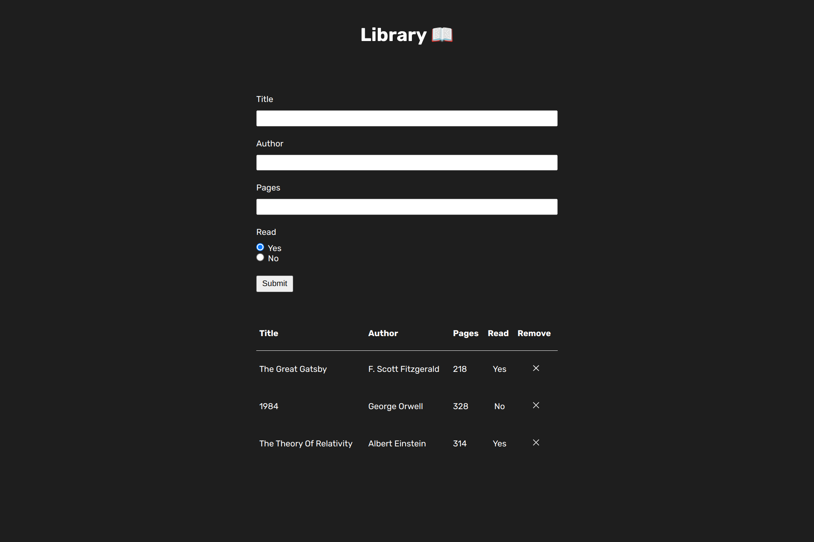

# Library 📖

  

<h2 align="center">
  <a href="https://nightrunner4.github.io/library">👉 Demo</a>
</h2>

### About 📖

First project of the JavaScript chapter in [The Odin Project](https://www.theodinproject.com). A good practice of objects, constructors, methods and working with the prototype.

### Resources Used 📚

- [Google Fonts](https://fonts.google.com) (Icons & Font)
- [EmojiTerra](https://emojiterra.com) (Emojis)

### Built With 🛠️

- HTML
- CSS
- JavaScript
